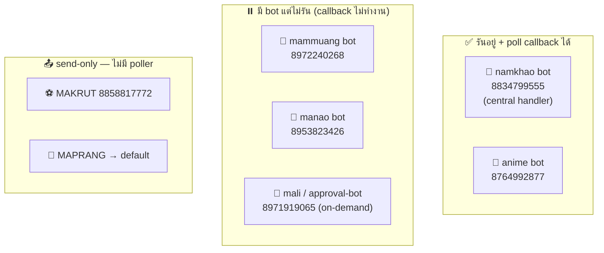
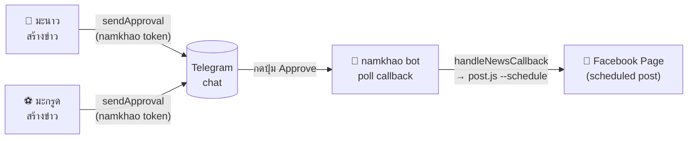
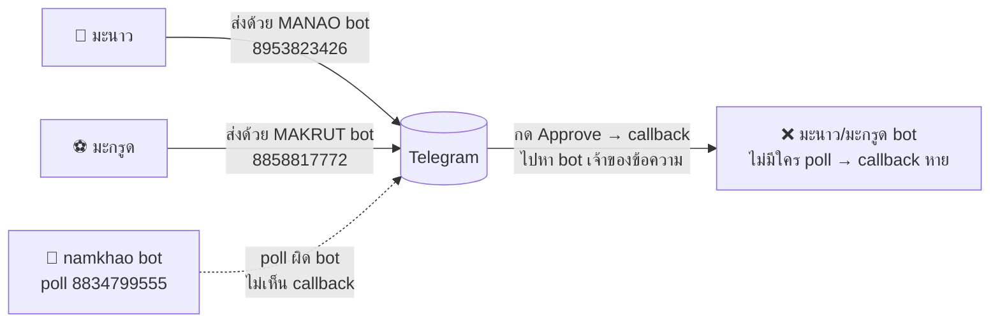

# Telegram Bot Tokens — แผนผังการใช้งาน

> สถานะ ณ 2026-06-27 — bot ทั้งหมด, ตัวที่ใช้/ไม่ใช้, ใครรับ callback (poll) ใครส่งอย่างเดียว

## หลักการ (กุญแจของทุกอย่าง)

1. **ปุ่ม inline (Approve/Cancel) → callback ส่งกลับไปหา "bot ที่ส่งข้อความนั้น" เท่านั้น**
2. **1 token poll (`getUpdates`) ได้แค่ process เดียว** — 2 process poll token เดียวกัน → error **409 Conflict**
3. ส่งเฉย ๆ (ไม่มีปุ่ม) ใช้ token ไหนก็ได้ — ไม่มี callback ให้ route

→ **ปุ่ม inline ส่งด้วย token ไหน ต้องมี process poll token นั้น**

---

## ตารางสรุป token ทั้งหมด

| Env var | Bot ID | Poller (รับ callback) | สถานะ | บทบาท |
|---------|--------|----------------------|-------|-------|
| `NAMKHAO_TELEGRAM_BOT_TOKEN` | `8834799555` | [namkhao/telegram-bot.js](../agents/namkhao/telegram-bot.js) | ✅ **รันอยู่** | **ศูนย์กลาง** — รับ callback ข่าว (manao+makrut) + เมนู/สถานะ agent. **ส่ง approval ด้วยตัวนี้** (หลัง fix) |
| `ANIME_TELEGRAM_BOT_TOKEN` | `8764992877` | [anime/anime-bot.js](../agents/anime/anime-bot.js) | ✅ **รันอยู่** | บอทสร้างรูป anime (อิสระ) |
| `MAMMUANG_TELEGRAM_BOT_TOKEN` | `8972240268` | [mammuang/mammuang-bot.js](../agents/mammuang/mammuang-bot.js) | ⏸️ ไม่รัน (lock ค้าง) | บอทมะม่วง (image gen) |
| `MANAO_TELEGRAM_BOT_TOKEN` | `8953823426` | [manao/pipeline/telegram-bot.js](../agents/manao/pipeline/telegram-bot.js) | ❌ ไม่รัน | legacy bot; ตอนนี้ token ใช้แค่ **send-only** (status/summary) |
| `MAKRUT_TELEGRAM_BOT_TOKEN` | `8858817772` | — (ไม่มี poller) | 📤 send-only | ไม่มี bot poll token นี้เลย |
| `MALI_TELEGRAM_BOT_TOKEN` | `8971919065` | [approval-bot.js](../approval-bot.js) | 🔸 on-demand | Shopee affiliate approval bot (= ค่า default) |
| `TELEGRAM_BOT_TOKEN` (default) | `8971919065` | fallback | — | ค่า fallback (= MALI bot ตัวเดียวกัน) |
| `MAPRANG_TELEGRAM_BOT_TOKEN` | *(ไม่ได้ตั้ง)* | — | 📤 send-only | fallback → default, ส่งแจ้งเตือนอย่างเดียว |

> ⚠️ **MALI = default = `8971919065`** เป็น bot ตัวเดียวกัน

---

## แผนผัง: ใคร poll / ใคร send-only

---

## แผนผัง: flow การ approve ข่าว (สถาปัตยกรรมหลัง fix = center token)

**สำคัญ:** ปุ่มต้องส่งด้วย token เดียวกับที่ namkhao poll (`8834799555`) — callback ถึงจะถึง handler

---

## 🐛 บั๊กที่เคยเกิด (แก้แล้ว — PR #32)

**อาการ:** กด Approve แล้วเงียบ — ไม่มี error ไม่มีโพสต์
**สาเหตุ:** ส่งแบบ "แยก token" แต่รับแบบ "center" (poll แค่ namkhao) → callback ของ manao/makrut bot ไม่มีใคร poll
**แก้:** ส่ง approval ด้วย namkhao token ([tg-approval.js](../lib/tg-approval.js)) → ปุ่มเป็นของ namkhao bot ที่ poll อยู่

---

## Center token vs แยก token ต่อ agent

| | **Center (1 bot ทำทุกอย่าง)** | **แยก token ต่อ agent** |
|---|---|---|
| ปุ่ม/callback | ✅ ทำงานเสมอ (ส่ง+รับ bot เดียว) | ❌ ต้องมี poller ครบทุก bot ไม่งั้น callback หาย |
| Identity | ❌ ทุก agent มาจาก bot เดียว | ✅ แต่ละ agent เป็น bot ของตัวเอง |
| จำนวน process | ✅ น้อย | ❌ หลายตัว เสี่ยง 409 |
| เหมาะกับ | มี handler กลางตัวเดียว (เคสนี้) | อยากแยก identity + ยอมรัน poller ครบ |

**กฎจำง่าย:** ถ้า poll ครบทุก bot ไม่ได้ → ใช้ **center token** ปลอดภัยกว่า. แยก token เก็บไว้ใช้ **send-only** (notification ไม่มีปุ่ม) ได้อิสระ
